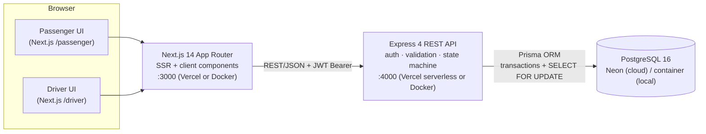
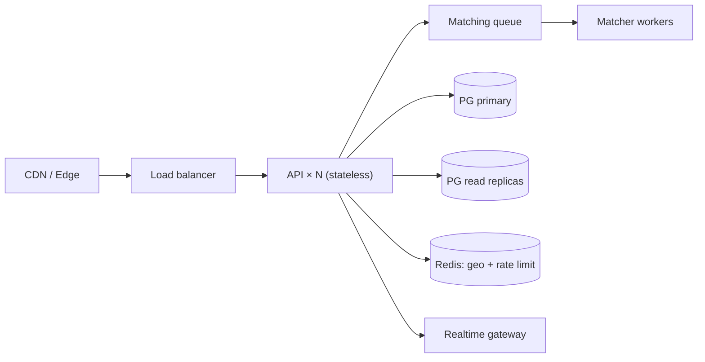

# 🛺 Dhaka Tesla Pool — Share a Seat. Split the Fare. Survive Dhaka Traffic.

An MVP for battery-powered Tesla (CNG-style three-wheeler) **ride-pooling in Dhaka**:
passengers request seats, compatible trips **share one Tesla**, each passenger gets an
**individual fare with a pool discount**, and drivers run a clear
**REQUESTED → MATCHED → DRIVER_ARRIVED → STARTED → COMPLETED (+ CANCELLED)** lifecycle.

Story cast (used consistently in seed data, tests, and docs): **Jashim** drives
**Bullet** (3 seats, online in Banani). **Nusrat** (Banani Road 11 → Mohakhali) and
**Rafiq** (Banani → Gulshan 1) share Bullet. **Shirin** (Banani → Farmgate) is waiting —
one seat left.

## ✨ Features

**Passenger (Nusrat / Rafiq / Shirin)**
- Sign up / log in, request ride (pickup zone, destination zone, 1–3 seats)
- Instant solo fare estimate; **auto-match** into a compatible open pool when one exists
- Live status stepper: waiting → matched → driver arrived → on trip → completed/cancelled
- Own fare only (privacy: pool members never see each other's fares), cancel while valid
- TeslaPay wallet (simulated top-up, auto-charged on completion) or Cash
- Ride history with final fares

**Driver (Jashim)**
- Register Tesla (name, capacity, base zone), go online/offline
- See waiting `REQUESTED` rides; accept 1..N into a new pool (compatibility + capacity enforced)
- Advance pool lifecycle (arrived → start → complete), cancel pool
- See every passenger/seat/fare in own pools + driving history

**Pool / system**
- Documented matching rule (§ Matching), capacity never exceeded (DB row-lock joins)
- Money in **integer paisa**; hand-testable fare model (§ Fare model)
- Full audit trail: `RideEvent` rows for every transition; wallet `Transaction` ledger
- Meaningful tests: fare math, matching (incl. Nusrat+Rafiq), lifecycle, ownership, live smoke

## 🏗 Architecture



Deployment targets: **Vercel** (frontend natively; backend via `api/index.js`
serverless wrapper + Neon) and **`docker compose up`** (Postgres + API + web).

### ERD

```mermaid
erDiagram
    User ||--o{ Vehicle : drives
    User ||--o{ RideRequest : "requests (passenger)"
    User ||--o{ Pool : "drives (driver)"
    User ||--o{ PoolMember : "rides as"
    User ||--o{ Transaction : "wallet ledger"
    Vehicle ||--o{ Pool : serves
    Pool ||--o{ PoolMember : contains
    Pool ||--o{ RideRequest : groups
    Pool ||--o{ RideEvent : logs
    RideRequest ||--o| PoolMember : "seated via"
    RideRequest ||--o{ RideEvent : logs

    User {
        string id PK
        string email UK
        string name
        string passwordHash
        enum role "PASSENGER|DRIVER|BOTH"
        int walletPaisa
    }
    Vehicle {
        string id PK
        string driverId FK
        string name "e.g. Bullet"
        int capacity
        bool isOnline
        string currentZone
        float currentLat
        float currentLng
    }
    Pool {
        string id PK
        string vehicleId FK
        string driverId FK
        enum status
        string pickupZone
        int totalSeats
        int occupiedSeats
    }
    RideRequest {
        string id PK
        string passengerId FK
        string pickupArea
        string dropoffArea
        float distanceKm
        int seatsRequested
        enum status
        int estimatedFarePaisa
        int finalFarePaisa "nullable"
        bool isPooled
        string poolId FK "nullable"
    }
    PoolMember {
        string id PK
        string poolId FK
        string rideRequestId FK UK
        string passengerId FK
        int seats
        int farePaisa
    }
    RideEvent {
        string id PK
        string poolId FK "nullable"
        string rideRequestId FK "nullable"
        string actorId FK "nullable"
        string fromStatus
        string toStatus
    }
```

### Matching rule (PRD §4)

Two requests are **compatible** iff, in order:

1. **Pool open** — status `REQUESTED`/`MATCHED` (checked first: cheap, deterministic)
2. **Capacity** — `occupiedSeats + seatsRequested ≤ totalSeats`
3. **Pickup-close** — same zone **or** Haversine ≤ **2.0 km**
4. **Dropoff-close** — same zone **or** ≤ **3.0 km**, **or** ≤ **4.0 km** when both
   pickups share a corridor (e.g. `"Banani Road 11" ⊂ "Banani"`)

This is why Nusrat (Banani Road 11 → Mohakhali) + Rafiq (Banani → Gulshan 1) pool
together despite different dropoffs (~3.5 km apart): same pickup corridor, within the
4 km corridor window. Mirpur → Uttara never matches them. No map APIs — 12 predefined
Dhaka zones with centroid lat/lng (`backend/src/utils/geo.js`).

### Fare model (PRD §5)

`passengerFare = baseFare + distanceCharge − poolDiscount`

- `BASE = ৳60` (6000 paisa) · `PER_KM = ৳30/km` (3000 paisa) · `POOL_DISCOUNT = 25%` when shared · floor at base fare
- Stored as **integer paisa** (100 paisa = 1 BDT) — never floats, so no `0.1+0.2` rounding bugs; formatting only at display edges
- Hand-check: Banani → Mohakhali ≈ 1.77 km → solo `6000 + 5310 = ৳113.10`, pooled `−25% → ≈৳84.80`
- Solo estimate at request time; re-priced to pooled fare the moment sharing becomes real (2nd member joins); `finalFarePaisa` frozen at completion; TeslaPay auto-debits wallet

### Lifecycle (PRD §3)

`REQUESTED → MATCHED → DRIVER_ARRIVED → STARTED → COMPLETED` (+ `CANCELLED`)

- `DRIVER_ARRIVED` is optional convenience — `MATCHED → STARTED` skip allowed
- Passenger cancel: only `REQUESTED`/`MATCHED` (seat returned, survivor re-priced to solo if alone)
- Driver cancel: before `STARTED`; after that only completion
- Every transition validated centrally (`utils/lifecycle.js`) and journaled to `RideEvent`

### Concurrency (the “1 seat left” problem)

Joins run in a Prisma interactive transaction (`timeout 20 s` for remote Neon latency):

```sql
SELECT id FROM "Pool" WHERE id = $1 FOR UPDATE;  -- row lock: claimants serialize
-- re-read occupiedSeats, capacity-check, insert member, update counters
```

The loser of the race re-reads fresh counters and gets `409 Pool is full`.
Re-pricing is skipped unless membership flips solo↔pooled (fewer writes = shorter lock hold).
Ride creation never fails because of matching — auto-match errors are caught and logged,
leaving the ride `REQUESTED` for manual accept. At larger scale: add a `version` column +
optimistic retry, then a matching queue/worker and read replicas.

## 🧰 Tech stack & why (PRD §7)

| Pick | Alternatives | Why it fits this MVP | When I'd switch |
|---|---|---|---|
| **Node + Express 4** (backend) | NestJS, Fastify | Small team, tiny surface; middleware + `api/index.js` maps 1:1 onto Vercel serverless | NestJS modules/DI past ~20 resources or multi-team |
| **PostgreSQL (Neon free tier)** | MySQL, SQLite, Mongo | Relational integrity (FKs, unique seat claims), `SELECT FOR UPDATE`, PostGIS path later | — (document store would lose transactional pooling) |
| **Prisma 5** | Drizzle, Knex/raw `pg` | Typed client, `db push` zero-friction migrations, great Vercel story | Drizzle if cold-start/edge runtimes dominate |
| **JWT (Bearer) + bcryptjs** | Sessions, OAuth | Stateless = Vercel-serverless friendly; no session store to run | OAuth (Google/phone) + refresh rotation at real launch |
| **Zod** | Joi, Yup | Shared shape validation with TS inference at API boundary | — |
| **Next.js 14 App Router** | CRA/Vite SPA | Routing/SSR out of the box, Vercel-native, `standalone` output for Docker | Vite SPA only if SEO/SSR never matters |
| **Tailwind** | MUI/Bootstrap | Fast responsive UI without a component-framework lock-in | Design system (shadcn) once brand stabilises |
| **Vitest + Supertest** | Jest | ESM-first, fast, same runner for unit + API tests | — |

No Kafka/Redis/K8s/microservices — a modular monolith is the honest scale for an MVP.

## 📁 Project structure

```
├── backend/                 # Express REST API (Vercel serverless-ready via api/index.js)
│   ├── api/index.js         # Vercel entry (re-exports Express app)
│   ├── prisma/schema.prisma # 7 models: User, Vehicle, Pool, RideRequest, PoolMember, RideEvent, Transaction
│   ├── prisma/seed.js       # Jashim + Bullet + Nusrat/Rafiq (pooled) + Shirin (waiting)
│   ├── src/{app,server,config,db}.js
│   ├── src/utils/{geo,fare,matching,lifecycle,auth}.js
│   ├── src/routes/{auth,meta,rides,driver,pools,wallet,history}.js
│   ├── scripts/{smoke.js,clean.js}
│   ├── tests/{unit.test.js,api.test.js}
│   ├── Dockerfile  vercel.json  .env.example
├── frontend/                # Next.js 14 App Router (Vercel-native, Docker standalone)
│   ├── app/{page,login,signup,passenger,driver,pools/[id],history}
│   ├── lib/{api,auth}  components/{Navbar,ui}
│   ├── Dockerfile  .env.example
├── docker-compose.yml       # Postgres 16 + api + web, healthchecks, auto-migrate+seed
├── .env.example             # compose variables (never secrets)
```

## 🚀 Run it

### Option A — Docker (recommended, matches PRD)

```bash
cp .env.example .env        # optional: defaults work as-is
docker compose up --build
# web → http://localhost:3000   api → http://localhost:4000/api/health
```

Compose pushes the schema, seeds the demo cast (`SEED_DEMO=false` to skip), and
health-checks Postgres (`pg_isready`) + API (`/api/health`).

### Option B — Local dev (Neon Postgres)

```bash
# backend
cd backend
cp .env.example .env        # set DATABASE_URL to your Neon pooled URL + JWT_SECRET
npm install
npx prisma db push
npm run db:seed
npm run dev                 # http://localhost:4000

# frontend (new terminal)
cd frontend
cp .env.example .env.local  # NEXT_PUBLIC_API_URL=http://localhost:4000
npm install
npm run dev                 # http://localhost:3000
```

### Option C — Vercel (free tier)

- **Frontend**: import `frontend/`, set `NEXT_PUBLIC_API_URL` to the API URL, deploy.
- **Backend**: import `backend/` (`vercel.json` routes everything to `api/index.js`),
  set `DATABASE_URL` (Neon pooled) + `JWT_SECRET`, deploy. Then point the frontend at it.

## 🧪 Tests

```bash
cd backend
npx vitest run              # unit: fare math, matching, lifecycle (10 tests)
npm run smoke               # needs `npm run dev` running: full lifecycle against live API
npm run race                # needs `npm run dev` running: 1-seat claim race → exactly one 200 + one 409
```

- `tests/unit.test.js` — Nusrat/Rafiq pooled fares, corridor compatibility, capacity never exceeded, invalid transitions rejected
- `tests/api.test.js` — ownership (user B can't read user A's ride), auth enforcement (live, opt-in via `RUN_LIVE_TESTS=1`)
- `scripts/smoke.js` — signup → vehicle → topup → request → accept → arrived → started → completed, wallet debited exactly, `422` on illegal transition, `401` unauthenticated; cleans up after itself
- `scripts/race.js` — two passengers slam the last seat simultaneously; asserts exactly one `200` + one `409` and the pool ends exactly at capacity; cleans up after itself

## 🔑 Demo credentials (seeded)

| Who | Email | Password | State |
|---|---|---|---|
| Jashim (driver) | `jashim@teslapool.com` | `driver123` | Bullet · 3 seats · online |
| Nusrat | `nusrat@teslapool.com` | `passenger123` | Pooled with Rafiq |
| Rafiq | `rafiq@teslapool.com` | `passenger123` | Pooled with Nusrat |
| Shirin | `shirin@teslapool.com` | `passenger123` | Waiting — 1 seat left in Bullet |

## 📡 API overview

| Method & path | Who | What |
|---|---|---|
| `POST /api/auth/signup|login` · `GET /api/auth/me` | all | JWT auth (7-day Bearer) |
| `GET /api/areas` · `GET /api/fare-rules` · `GET /api/health` | public | Zones, fare constants, health |
| `GET /api/stats` | public | Live homepage snapshot: counts, featured pool, demo-cast statuses (no fares/PII) |
| `POST /api/rides/request` | passenger | Create request + best-effort auto-match |
| `GET /api/rides/my` · `GET /api/rides/:id` | owner / assigned driver | Privacy: passengers see only own fare rows |
| `POST /api/rides/:id/cancel` | owner | While `REQUESTED`/`MATCHED`; seat returned |
| `POST /api/driver/vehicle` · `PATCH /api/driver/status` | driver | Tesla register + online toggle |
| `GET /api/driver/requests` · `GET /api/driver/pools` | driver | Waiting rides + own pools |
| `POST /api/driver/pools` | driver | Accept 1..N requests → pool (compat + capacity checked) |
| `GET /api/pools/:id` | member / driver | Pool detail + timeline |
| `POST /api/pools/:id/join` · `POST /api/pools/auto-match` | passenger | Claim a seat (row-locked) |
| `PATCH /api/pools/:id/status` | driver | Advance lifecycle, propagate + charge wallet |
| `GET /api/wallet` · `POST /api/wallet/topup` | all | Balance, ledger, simulated top-up |
| `GET /api/history` | all | Unified ride + pool + event history |

## ⚖️ Key decisions & trade-offs

1. **REST over GraphQL** — CRUD + transitions fit resources; one client, no schema-stitching overhead.
2. **Integer paisa** — exact money; floats never touch the ledger.
3. **Corridor exception (4 km)** — overlapping-but-not-identical trips *should* share (the whole point of the PRD story); documented + unit-tested with real coordinates.
4. **Auto-match best-effort, never blocking** — a matching failure degrades to manual driver accept instead of a 500 on ride creation.
5. **No real-time sockets** — refresh-button polling; WebSockets/SSE when dispatch SLA demands it.

## ⚠️ Known limitations → next

- Polling, not push · single Neon DB (add read replica + caching) · no ratings (schema-ready) · no real payments (TeslaPay simulated) · zone centroids, not routing · JWT without refresh rotation · rate-limit only on `/api/auth`.

## 🚀 If Oi Tesla goes viral (1M pax / 100k drivers)

Stateless API behind a LB (scale horizontally) → Postgres primary + read replicas,
hot indexes (`status`, `pickupZone`, `createdAt`), Redis for geospatial pool search +
rate limits, SQS/BullMQ matching queue + idempotency keys, PostGIS `KNN` for pickup
search, WebSocket gateway for live driver/pax updates, CDN + edge cache for zones/fares,
structured logs + traces + fare/match dashboards, blue-green deploys.



## 🤖 AI usage

Built with AI assistance (code generation + debugging) under human direction; every
file was read, executed, and tested locally. Accepted: row-lock join pattern and
conditional re-pricing (verified by live smoke test). Rejected: an early plan to put
auto-match inside the request transaction (would hold locks across pool search —
moved to best-effort after creation; failure there must never 500 a ride request).

## 📹 Demo video

> TODO: record ≤6 min (problem → engineering → tour) and link here.
